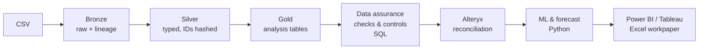
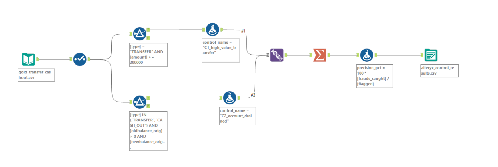
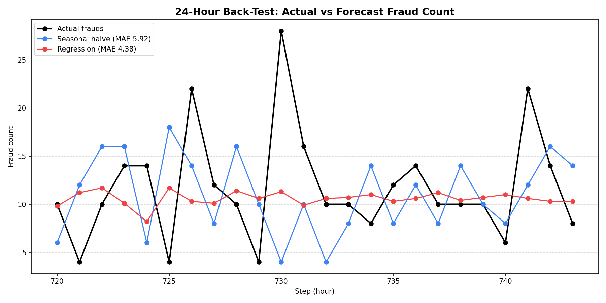
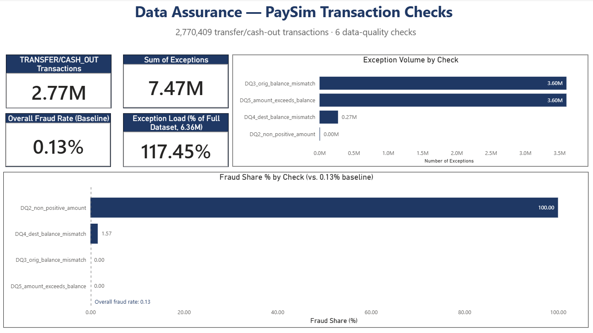
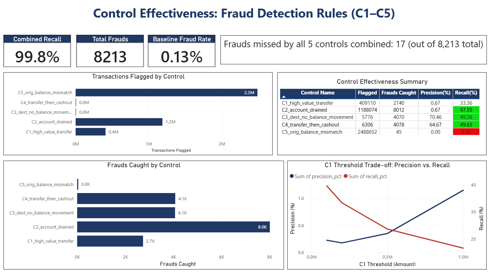
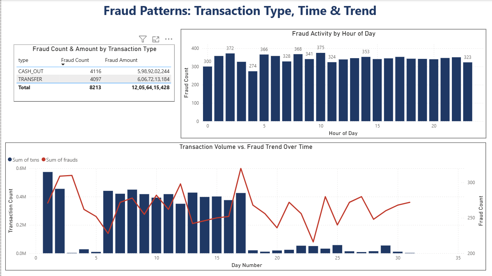
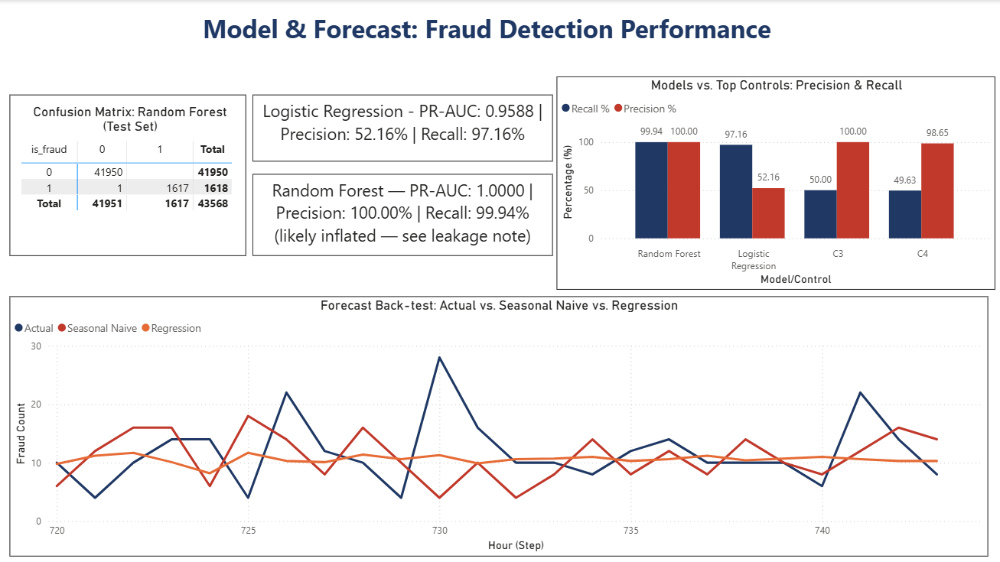

# Payment Transaction Controls & Fraud Risk Analytics

**Tools:** Databricks (PySpark, SQL) · Alteryx · Python (pandas, scikit-learn) · Power BI · Tableau · Excel
**Data:** PaySim synthetic mobile-money transactions (Kaggle), 6,362,620 rows, 8,213 frauds.
Account IDs were hashed in the Silver layer, so no raw identifiers are used downstream.
All amounts below are PaySim's simulated units, not real currency.

## Objective
Assess how reliable the transaction data is, test how well rule-based controls detect
fraud, and check whether a predictive model closes the gaps the rules leave.

## Architecture
CSV → **Bronze** (raw + lineage) → **Silver** (typed, IDs hashed) → **Gold** (analysis tables)
→ data-assurance checks & controls (SQL) → Alteryx reconciliation → ML & forecast (Python)
→ Power BI / Tableau / Excel workpaper

## 1. Load reconciliation
| Measure | Source CSV | Bronze | Silver | Gold |
|---|---|---|---|---|
| Rows | 6,362,620 | 6,362,620 | 6,362,620 | 6,362,620 |
| Total amount | 1,144,392,944,759.77 | 1,144,392,944,759.77 | 1,144,392,944,759.77 | 1,144,392,944,759.77 |
| Fraud rows | 8,213 | 8,213 | 8,213 | 8,213 |

Source CSV, Bronze, Silver and Gold all match exactly on rows, total amount and fraud
count, so nothing was dropped or duplicated as the data moved through the pipeline. The
Source CSV figures were confirmed with a direct read of the raw file on 2 Oct 2026 —
this wasn't captured at the time of the original load, so it's a later confirmation check rather than a pre-load check.

## 2. Data assurance
| Check | Exceptions | % of transactions | Fraud share |
|---|---|---|---|
| DQ1 (missing key fields) | 0 | 0.00% | — |
| DQ2 (non-positive amount) | 16 | 0.00% | 100% |
| DQ3 (orig balance mismatch) | 3,601,595 | 56.606% | 0% |
| DQ4 (dest balance mismatch) | 269,723 | 4.239% | 1.57% |
| DQ5 (amount exceeds balance) | 3,601,544 | 56.605% | 0% |
| DQ6 (possible duplicate postings) | 0 | 0.00% | — |

**Findings:** DQ1 and DQ6 returned no exceptions. DQ3 and DQ5 fail on more than half
the transactions, but at 0% fraud share — this is the same balance-mismatch pattern
that shows up again in the ML section, not a data quality problem tied to fraud. The
pattern follows transaction type: CASH_IN transactions tend to pass these checks while
outgoing types (TRANSFER, CASH_OUT) tend to fail them, which lines up with how PaySim
simulates balances. DQ2, by contrast, is rare (16 rows) but 100% fraud — small in
volume but worth flagging on its own. Baseline fraud rate across the dataset is 0.13%
(8,213 / 6,362,620), which is the number every control's precision should be read
against.

This isn't a contradiction with the model section below: DQ3 failures (orig balance
mismatch) carry 0% fraud share, yet `orig_balance_error` is the model's top feature.
In PaySim, fraud is the case where the sender's balance *does* reconcile exactly —
the account is drained to the cent — so the model is keying off the absence of a
mismatch, not its presence. That's the same balance-draining artifact discussed in
Section 4.

## 3. Control testing
| Control | Flagged | Frauds caught | Precision | Recall |
|---|---|---|---|---|
| C1 | 409,110 | 2,740 | 0.67% | 33.36% |
| C2 | 1,188,074 | 8,012 | 0.67% | 97.55% |
| C3 | 5,776 | 4,070 | 70.46% | 49.56% |
| C4 | 6,306 | 4,078 | 64.67% | 49.65% |
| C5 | 2,488,652 | 45 | 0.00% | 0.55% |

These figures are on the full dataset (0.13% fraud rate). Section 4 re-measures the controls on the model's test window for a fair comparison.

- Combined, controls caught 8,196 of 8,213 frauds, across 2,502,462 flagged
  transactions (alerts). Missed: 17.
- The Sample_Review sheet in the workbook (the raw sample is saved as excel/sample_review_25.csv) is a separate check: a
  stratified sample of 25 flagged transactions (5 per control), manually reviewed.
  7 were actual fraud (C3 4/5, C4 3/5); the other 18 were false positives (C1, C2 and C5
  0/5). It doesn't cover the 17 missed frauds. Those aren't independently verified beyond
  the control logic itself.
- C1 threshold trade-off: raising the C1 threshold cuts the number flagged a lot but
  only costs a small amount of recall at first, then recall drops off faster as the
  threshold goes higher — see `excel/control_testing_workpaper.xlsx`, Thresholds sheet,
  for the exact precision/recall at each threshold tested.
- Simulator's own control (`isFlaggedFraud`) flagged only 16 true frauds out of 8,213 —
  it isn't a usable control on its own.

### Alteryx reconciliation
| Control | SQL flagged | Alteryx flagged | Match |
|---|---|---|---|
| C1 | 409,110 | 409,110 | Exact |
| C2 | 1,188,074 | 1,188,074 | Exact |

*No differences between SQL and Alteryx outputs — both controls matched exactly.*

## 4. Predictive model
Time-based split (train step < 600). TRANSFER and CASH_OUT only. Precision, recall
and PR-AUC reported, not accuracy (fraud < 1% of rows).

Train: 2,726,841 rows, 6,595 frauds. Test: 43,568 rows, 1,618 frauds.

| Model | Precision | Recall | PR-AUC |
|---|---|---|---|
| Logistic regression | 52.16% | 97.16% | 0.9588 |
| Random forest | 100.00% | 99.94% | 1.0000 |

- Top features: `orig_balance_error` (36.3%), `amount_to_balance` (25.2%),
  `orig_drained` (10.0%).
- The random forest's near-perfect scores are a red flag, not a win: those top
  features are built from the same balance-draining pattern PaySim uses internally
  to simulate fraud, so the model is partly reading the simulator's own logic rather
  than learning a generalizable fraud pattern. I'd trust the logistic regression's
  numbers more as a realistic estimate of what a model could do on this kind of data.

### Comparing the model and the controls fairly
The controls above were tested on the full dataset (0.13% fraud rate). The model's test
set (step ≥ 600) has a 3.71% fraud rate, about 28x higher, so the two aren't directly
comparable as originally presented. For a fair comparison, the five controls were
re-measured on the same test window:

| Control | Precision | Recall |
|---|---|---|
| C3 (dest no balance movement) | 100.00% | 50.00% |
| C4 (transfer-then-cashout) | 98.65% | 49.63% |
| C1 (high-value transfer) | 7.60% | 33.75% |
| C2 (account drained) | 6.74% | 96.17% |
| C5 (balance mismatch) | 0.02% | 0.49% |

On this like-for-like basis, C3 matches the random forest's precision (100%) and C4 is
within about 1.4 points of it. Both are far above logistic regression's 52.16%, so the
earlier framing that logistic regression beats every rule on precision was an artifact of
comparing it against controls tested on a much lower-fraud population. The real trade-off
is recall: C3 and C4 catch only about 50% of fraud in this window, versus 97%+ for both
models.

## 5. Forecast (next 24 hours)
Forecast target is **fraud count per hour**, not transaction volume.
Back-test MAE: seasonal naive 5.92 vs regression 4.38. Chosen: regression.

Fraud holds steady at roughly 10-12 incidents per hour across the ~31 simulated days,
with no strong hourly or daily cycle — unlike transaction volume, which collapses
after day 17 as legitimate activity winds down while fraud keeps pace. A short linear
trend plus lag-24 term tracks that steadier fraud series better than "repeat whatever
happened at this hour last cycle." (An earlier version of this forecast was run
against transaction volume and mislabeled as a fraud forecast — the numbers above are
the corrected run, targeting `frauds` directly.)

## 6. Dashboards & workpaper
- Power BI: a 4-page dashboard covering data assurance, control effectiveness, fraud
  patterns, and model/forecast performance (the `.pbix` file itself is ~320 MB, over
  GitHub's 100 MB file limit, so it isn't in this repo — screenshots below)

  **Data Assurance** — transaction counts, exception volume by check, and fraud share
  by check against the 0.13% baseline
  

  **Control Effectiveness** — C1–C5 performance summary with conditional formatting,
  transactions flagged vs. frauds caught by control, and the C1 threshold trade-off
  

  **Fraud Patterns** — fraud count and amount by transaction type, fraud activity by
  hour of day, and transaction volume vs. fraud trend across the ~31-day simulation
  

  **Model & Forecast** — Random Forest confusion matrix, model vs. top-control
  precision/recall comparison, and the forecast back-test (actual vs. seasonal naive
  vs. regression)
  

- Tableau Public: [Payment Fraud Risk Analytics – PaySim](https://public.tableau.com/app/profile/aditya.ranjan7019/viz/PaymentFraudRiskAnalytics-PaySim/FraudAnalyticsDashboard) — fraud heatmap by day/hour and a transactions-vs-frauds trend line (workbook: tableau/payment_fraud_analytics.twbx)
- Excel: `excel/control_testing_workpaper.xlsx` — control effectiveness, exceptions pivot, stratified 25-row manual sample review, and threshold trade-off analysis

## Limitations
- PaySim is synthetic, and its balance fields make fraud unusually easy to separate.
  Real-world performance would be much lower — my random forest's 100% precision / 99.94%
  recall is a sign of this, not of a good model. The top features it used
  (orig_balance_error, amount_to_balance, orig_drained) are built from the same
  balance-draining pattern PaySim uses to simulate fraud, so the model is partly
  learning the simulator rather than learning fraud.
- Only ~31 days of simulated time, so the forecast is illustrative, not something I'd
  size a staffing or monitoring decision on.
- C5 (`C5_orig_balance_mismatch`, the sender-balance-mismatch rule) flags the most
  transactions of any control (2,488,652) but catches almost no fraud (45 of 8,213,
  0.00% precision) — it's essentially noise. Separately, the simulator's own built-in
  flag (`isFlaggedFraud`) caught only 16 of 8,213 frauds and isn't used as one of the
  five controls at all — it's included only as a benchmark.
- The 17 frauds the combined controls missed, and the 25 transactions reviewed in
  Sample_Review, are too few to generalize a root cause from. They illustrate the review
  process and are not a basis for conclusions about fraud typology.
- C4 matches a transfer to any same-amount cash-out within one step, with no account
  link. PaySim caps transfers at 10,000,000, so some matches are coincidental (2 of the 5
  C4 rows in the review sample).

## Recommendations
1. Keep C3 and C4 (the type- and amount-based rules with ~50% recall) as the primary
   controls — they're simple, explainable, and catch roughly half of fraud on their own.
2. Retire or redesign C5. The sender-balance-mismatch rule flags more transactions
   than any other control (2.49M) but catches almost no fraud (45 of 8,213) — in a
   real deployment it would need a materially different threshold or criteria to be
   worth the review volume it generates.
3. Use the logistic regression model (52% precision, 97% recall) to prioritize alerts
   from C1/C2, rather than relying on the random forest — its near-perfect scores come
   from the balance-draining artifact described above, which wouldn't hold on real data.
4. Document the C1 threshold choice and review it quarterly — the threshold experiment
   showed precision and recall move a lot depending on where the cutoff is set, so this
   shouldn't be a one-time decision.
5. Monitor for model drift rather than treating any model as fixed — even a non-leaky
   model would need retraining as fraud patterns shift over time.

## Research
See `docs/research_memo.md`.

## How to run
1. Upload the PaySim CSV to a Databricks volume and run `databricks/01` → `02` → `03`.
2. Run `sql/04` → `sql/05` and export the CSVs listed at the end of `05`.
3. `pip install -r requirements.txt`.
4. `python python/06_fraud_model.py --csv gold_transfer_cashout.csv`
5. `python python/07_forecast.py --csv data_exports/gold_hourly_summary.csv --target frauds`
   (`--target frauds` is required; without it the script forecasts transaction volume instead.)
6. `python plot_forecast.py` (run from the project root; it redraws `docs/screenshots/forecast.png` from `data_exports/forecast_backtest.csv`).
7. Open `alteryx/controls_C1_C2.yxmd` and `excel/control_testing_workpaper.xlsx`.
   (`dashboards/payment_controls.pbix` and `gold_transfer_cashout.csv` are not in this repo —
   both are too large for GitHub's 100 MB file limit. The `.pbix` is represented by
   screenshots in Section 6; `gold_transfer_cashout.csv` is regenerated by running
   `sql/05_controls.sql` and exporting as described there.)